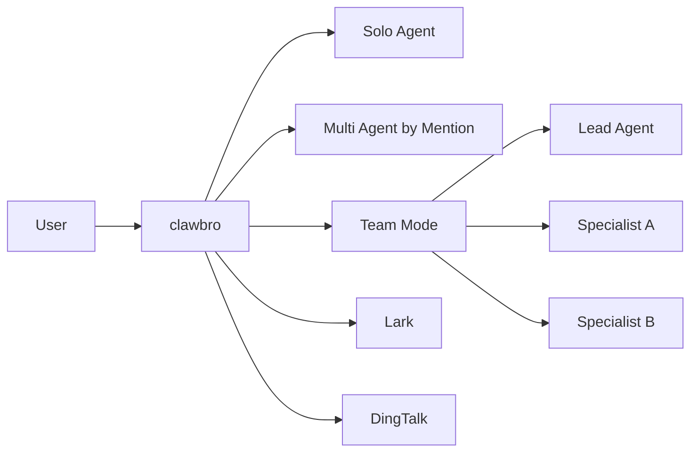

# ClawBro

ClawBro 是一个把多种 CLI Agent、原生 Agent Runtime、Lark、DingTalk 和 Team 协作模式接到同一控制面的 AI 系统。

它的目标不是只做“再包一层聊天机器人”，而是把下面这些能力放进同一个系统里：

- 一个统一入口：`clawbro`
- 一个统一控制面：会话、路由、绑定、诊断、定时任务、Team orchestration
- 多种执行后端：`claw_bro_native`、ACP、OpenClaw Gateway
- 多种使用形态：单人助理、群聊 bot、研发协作工作台、研究型 Team

---

## Why ClawBro

很多 AI 工具只能做一件事：

- 只能在本地 CLI 里跑
- 只能对接一个 provider
- 只能一对一聊天
- 不能在群聊里稳定工作
- 不能把“主 Agent + specialist”协作做成长期可运行系统

ClawBro 解决的是这几个问题叠在一起之后的工程现实：

| 需求 | ClawBro 的做法 |
| --- | --- |
| 想把多个 CLI Agent 接到同一入口 | 统一通过 runtime backend family 接入 |
| 想把 AI 接到飞书 / 钉钉 | 内置 channel runtime |
| 想从单 Agent 升级到 Team | 同一份配置里支持 `solo / multi / team` |
| 想保留工程可控性 | 有 config validate、doctor/status、health、allowlist、approval |
| 想做真正的“任务驱动协作” | Lead + Specialists + TaskRegistry + Team runtime |

---

## What It Feels Like

```text
User / Group Chat
        |
        v
    clawbro
        |
        +--> Routing / Session / Memory / Team
        |
        +--> claw_bro_native ----> clawbro runtime-bridge ----> clawbro-agent-sdk
        |
        +--> ACP backends --------> claude / codex / qwen / custom ACP CLI
        |
        +--> OpenClaw Gateway ----> remote agent gateway
```

或者从用户视角看，它更像这样：



---

## What You Can Build

### 1. Personal AI workspace

- 单人使用
- `clawbro setup --mode solo`
- 适合：写作、代码、日常问答、研究摘要

### 2. Multi-agent group bot

- 群里 `@planner`、`@reviewer`、`@researcher`
- 每个 agent 单独响应
- 适合：角色助手、部门 bot、多人协作群

### 3. Team mode orchestration

- 一个 Lead 接收需求
- 多个 Specialists 被分配任务
- milestone 由 Lead 汇总输出
- 适合：研发协作、论文研究、复杂任务拆分

### 4. IM-connected AI workbench

- Lark / DingTalk 接入
- 群聊和单聊都可配置
- 可与 team scope、group routing、bindings 组合

---

## Real Scenarios

下面这些场景是当前这套系统特别合适的方向。

### Engineering Team

- Lead 负责任务拆分
- `coder` 写实现
- `reviewer` 做 code review
- `tester` 补测试和边界条件

### Research Team

- `planner` 拆研究问题
- `searcher` 查材料
- `critic` 找反例
- `writer` 汇总输出

### Group Chat Workbench

- 群里直接把需求发给 front bot
- Lead 后台调度 specialist
- milestone 持续对外汇报

### Fun Modes

- MBTI / 角色扮演群聊
- 桌游主持 / 剧情分工
- “产品经理 + 程序员 + 审稿人” 的 AI 对练

---

## Quick Start

### 1. Build

```bash
cd clawBro
cargo build -p clawbro --bin clawbro
```

### 2. Run setup

```bash
clawbro setup
```

或者直接非交互初始化一个 Team：

```bash
clawbro setup \
  --lang en \
  --provider anthropic \
  --api-key sk-ant-xxx \
  --mode team \
  --team-target group \
  --front-bot planner \
  --specialist coder \
  --specialist reviewer \
  --team-scope group:lark:chat-123 \
  --team-name ops-room \
  --non-interactive
```

### 3. Validate config

```bash
clawbro config validate
```

### 4. Start the gateway

```bash
source ~/.clawbro/.env
clawbro serve
```

---

## CLI Experience

用户入口统一是：

```bash
clawbro
```

常用命令：

| 命令 | 作用 |
| --- | --- |
| `clawbro setup` | 首次初始化 |
| `clawbro serve` | 启动服务 |
| `clawbro status` | 查看当前配置摘要 |
| `clawbro doctor` | 诊断环境和运行时问题 |
| `clawbro config validate` | 校验配置 |
| `clawbro auth list` | 查看已配置 key |
| `clawbro completions zsh` | 生成 shell 补全 |

---

## Integrations

### Native runtime

- family: `claw_bro_native`
- 使用 `clawbro` 内置的 hidden runtime bridge / ACP agent
- 对用户最省依赖

### ACP CLI backends

- Claude
- Codex
- Qwen
- Goose
- 自定义 ACP CLI

### IM Channels

- Lark / Feishu
- DingTalk

---

## Documentation Map

- 完整安装与配置：
  - [`docs/setup.md`](docs/setup.md)
- 从零部署与运行时概览：
  - [`docs/getting-started-from-zero.md`](docs/getting-started-from-zero.md)
- Runtime backend 说明：
  - [`docs/runtime-backends.md`](docs/runtime-backends.md)
- Routing contract：
  - [`docs/routing-contract.md`](docs/routing-contract.md)
- Doctor / Status 运维面：
  - [`docs/operations/doctor-and-status.md`](docs/operations/doctor-and-status.md)

---

## Current Positioning

ClawBro 现在最适合这三类用户：

- 想把 AI 接进群聊和工作流的工程团队
- 想用 Lead + Specialists 做复杂任务的个人开发者
- 想把不同 CLI Agent 和原生 runtime 接进统一控制面的系统设计者

如果你只是想要一个单机对话 CLI，这个项目不是最轻的选择。  
如果你想要一个可扩展、可接 IM、可做 Team orchestration 的控制面，这个项目就是为这个方向做的。
