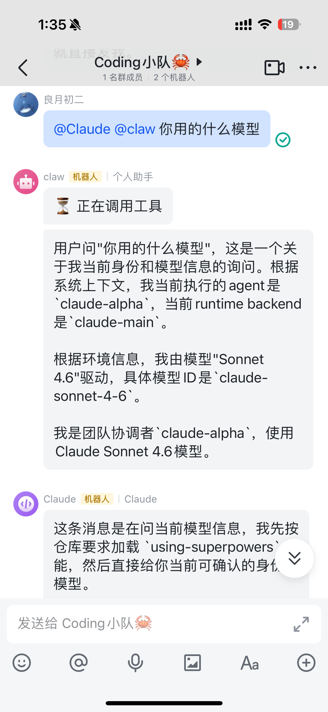
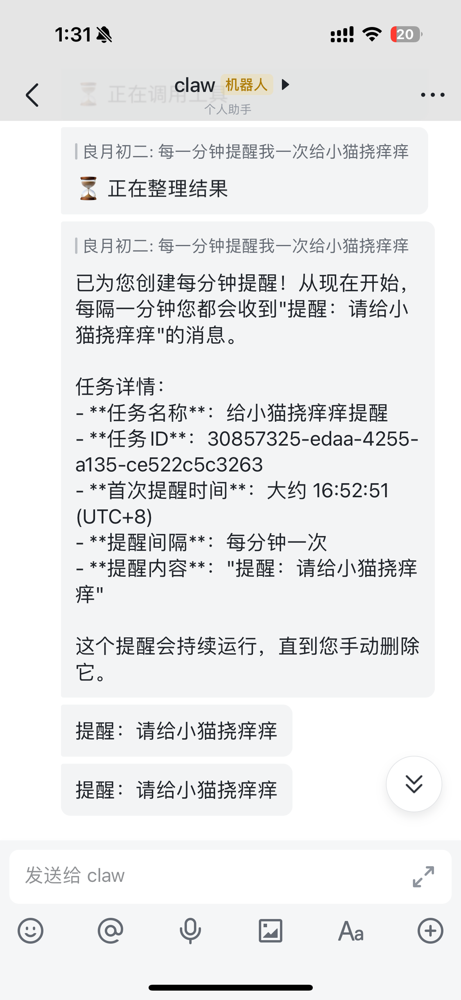
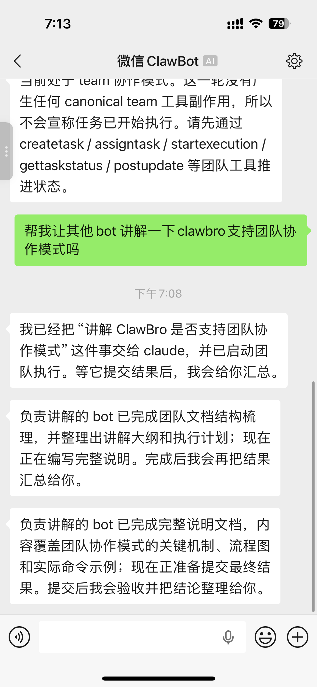

<div align="center">
  
  <h1>🦀 clawBro：CLI Coding Agent を OpenClaw のように、チャットとチーム協業の中で本当に働かせる</h1>
  <p>
    <strong>OpenClaw の発想を土台に、Claude Code、Codex、Qwen、Qoder、Gemini などの CLI Coding Agent を協調動作させ、WeChat、Lark、DingTalk、チームワークフローへ接続します。</strong>
  </p>
  <p>
    <a href="./README.md"><strong>English</strong></a> ·
    <a href="./README_ZH.md"><strong>中文</strong></a> ·
    <a href="./README_KO.md"><strong>한국어</strong></a>
  </p>
  <p>
    <a href="#-プロジェクト状況">プロジェクト状況</a> ·
    <a href="#️-アーキテクチャ">アーキテクチャ</a> ·
    <a href="#-ユースケース">ユースケース</a> ·
    <a href="#-クイックスタート">クイックスタート</a> ·
    <a href="#-チームモード">チームモード</a> ·
    <a href="#-cli-coding-agent-統合">CLI Coding Agent 統合</a> ·
    <a href="./docs/setup.md">セットアップ</a>
  </p>
  <p>
    
    
    
    
    
    
    
  </p>
</div>

`clawBro` は Rust で書かれた AI 協業システムです。単なるチャットボットのラッパーではなく、複数の CLI Coding Agent を実際に一緒に働かせることを目的としています。

OpenClaw の方向性を受け継ぎつつ、より実務的な協業に寄せています。Claude Code、Codex、Qwen、Qoder、Gemini などを同じワークフローに組み込み、WeChat、DM、グループチャット、Lark、DingTalk、WebSocket、Team モードで連携させられます。

公式 WeChat ロブスター経路も強く意識しています。WeChat の front bot が表で会話を保ちながら、裏側で shrimp soldiers と crab generals に仕事を振る構成を取れます。

## 📢 プロジェクト状況

- **[03-20]** 永続スケジューラを内蔵しました。1 回だけのリマインド、指定時刻実行、固定間隔のポーリング、cron 実行、チャットからの作成、現在の会話単位での一括削除まで同じランタイムで扱えます。
- **[03-19]** 複数の AI CLI Coding Agent を 1 つの協業フローにまとめ、ツールごとに別々の運用をしなくてよくなりました。
- **[03-19]** 現在もっとも安定している形は、Lead が外向きの応答を担い、specialist が裏側で実行し、Lead が milestone をまとめる形です。
- **[03-19]** WeChat、Lark、DingTalk Stream Mode、DingTalk Custom Robot Webhook、WebSocket に接続でき、ローカル利用からグループ利用まで段階的に広げられます。
- **[03-19]** 複数 IM に同時常駐できるため、1 つの `clawbro` ランタイムを WeChat・Lark・DingTalk・チーム会話へ常時つないだまま運用できます。
- **[03-19]** approvals、allowlist、memory-aware sessions、`/health`、`/status`、`/doctor`、diagnostics を備えています。

> `clawBro` は、エンジニアリング協業、リサーチワークフロー、グループチャット AI アシスタント、多 Agent 実験向けのプロジェクトです。

## 📸 デモ

<table align="center">
  <tr align="center">
    <td><br><sub><b>グループチャットで複数 Bot に同時メンション</b></sub></td>
    <td><br><sub><b>チャットから定期タスクを作成</b></sub></td>
    <td><br><sub><b>WeChat でのチームモード協業</b></sub></td>
  </tr>
</table>

## clawBro の主な特徴

🤖 **統合 CLI Coding Agent**：Claude Code、Codex、Qwen、Qoder、Gemini などを同じ仕組みの中で動かせます。

👥 **チーム協業モード**：`solo`、`multi`、`team` をサポートし、個人利用から Lead + Specialists まで拡張できます。

💬 **チャット接続**：Lark / DingTalk に接続でき、まずは WebSocket から始めることも可能です。

📡 **常時接続の Multi-IM**：同じ `clawbro` ランタイムを Lark、DingTalk Stream、DingTalk Webhook、WebSocket にまたがって常時オンラインにできます。

🧠 **記憶と習慣**：共有メモリや役割メモリを通じて、プロジェクト文脈や好みを蓄積できます。

⏰ **スケジュール実行**：`delay`、`at`、`every`、`cron` を使って、リマインドも定期的な agent 作業も同じ制御面で扱えます。

🛡️ **運用しやすさ**：config validate、doctor/status、承認、ヘルスチェックを備えています。

## 🏗️ アーキテクチャ

```text
ユーザー / グループ / WebSocket / Scheduled Jobs
              |
              v
           clawbro
              |
              +--> ルーティング / セッション / メモリ / Bindings / Team
              |
              +--> ClawBro Native ------> runtime-bridge ------> clawbro-agent-sdk
              |
              +--> Coding CLI Bridge ---> Claude / Codex / Qwen / Qoder / Gemini / custom coding CLIs
              |
              +--> OpenClaw Gateway ----> remote agent runtime
              |
              +--> Channels ------------> Lark / DingTalk / WebSocket delivery
```

## 目次

- [プロジェクト状況](#-プロジェクト状況)
- [主な特徴](#clawbro-の主な特徴)
- [アーキテクチャ](#️-アーキテクチャ)
- [機能概要](#-機能概要)
- [ユースケース](#-ユースケース)
- [インストール](#-インストール)
- [クイックスタート](#-クイックスタート)
- [定時タスク](#-定時タスク)
- [チームモード](#-チームモード)
- [CLI Coding Agent 統合](#-cli-coding-agent-統合)
- [チャットチャンネル](#-チャットチャンネル)
- [設定と運用](#️-設定と運用)
- [プロジェクト構成](#️-プロジェクト構成)
- [ドキュメント](#-ドキュメント)
- [位置付け](#-位置付け)

## ✨ 機能概要

<table align="center">
  <tr align="center">
    <th><p align="center">🤖 Agent Hub</p></th>
    <th><p align="center">👥 チーム協調</p></th>
    <th><p align="center">🧠 長期記憶</p></th>
  </tr>
  <tr>
    <td align="center">Claude Code、Codex、Qwen、Qoder、Gemini などを同じ環境で扱えます。</td>
    <td align="center">Lead + Specialists、グループでの役割ルーティング、milestone 型の協業を支えます。</td>
    <td align="center">共有メモリと役割メモリにより、習慣・文脈・好みを継続的に蓄積できます。</td>
  </tr>
</table>

## 🌟 ユースケース

### 🚀 フルスタック開発

- `@planner` が要件を分解
- `@coder` が API、UI、データモデルを実装
- `@reviewer` が品質とリスクを確認
- `@tester` が境界条件と不足テストを補完

Team モードでは Lead が対外窓口を保ちつつ、specialist が裏側で作業できます。グループチャットでは AI プロジェクトルームのように機能します。

### 📚 深い調査とレポート作成

- `@researcher` が資料を収集
- `@critic` が弱点や反例を探す
- `@writer` がレポートにまとめる
- Lead が進捗と最終結論を要約

技術調査、アーキテクチャ比較、論文レビュー、業界分析に向いています。

### 🧑‍💻 PR レビューと設計レビュー

- `@coder` が実装を見る
- `@reviewer` が保守性とリスクを見る
- `@researcher` が依存関係や代替案を調べる
- Lead が最終判断をまとめる

単発の bot 応答より、実際のチームレビューに近い体験になります。

### 💬 グループ内の多 Agent ワークベンチ

- `@planner`
- `@coder`
- `@reviewer`
- `@researcher`

といった役割名で、開発チーム、読書会、プロダクト議論、技術サポートなどに使えます。

### 🧠 記憶型の Coding 習慣

継続利用によって次のような情報を覚えられます。

- アーキテクチャの好み
- レビュー基準
- 命名スタイル
- プロジェクト固有の流れ
- 繰り返し覚えてほしい事項

### 🎭 遊びの使い方：人狼 / TRPG / ロール会話

- Lead が人狼の司会になる
- specialist が審判、解説、復盤役、キャラクターを担当
- グループで物語進行や役割会話を行う

## 📦 インストール

**推奨**

```bash
cargo install clawbro
```

**GitHub Release**（Rust 不要）

1. GitHub Releases から自分の環境向けアーカイブをダウンロード
2. 展開
3. `./clawbro --version` を実行

グローバルコマンドとして使いたい場合は `PATH` に置けます:

```bash
chmod +x clawbro
mv clawbro ~/.local/bin/clawbro
```

**npm**（バイナリインストーラ）

```bash
npm install -g clawbro
clawbro --version
```

**ソースからビルド**（開発者向け）

```bash
cd clawBro
cargo build -p clawbro --bin clawbro
```

## 🚀 クイックスタート

> [!TIP]
> ここでは典型例だけに絞ります。詳細な組み方は [Setup Guide](./docs/setup.md) か `clawbro config wizard` を使ってください。

**ケース 1: ローカル最小構成**

```bash
cargo install clawbro
clawbro setup
clawbro config validate
source ~/.clawbro/.env
clawbro serve
```

**ケース 2: 公式 WeChat ロブスター、solo**

```bash
clawbro setup --preset wechat-solo
clawbro config channel login wechat
clawbro config channel setup-solo wechat --agent claw
clawbro config validate
clawbro serve
```

**ケース 3: WeChat DM Team、front bot が部隊を率いる**

```bash
clawbro setup --preset wechat-dm-team
clawbro config channel login wechat
clawbro config channel setup-team wechat \
  --scope user:o9cqxxxx@im.wechat \
  --front-bot claude \
  --specialist claw
clawbro config validate
clawbro serve
```

## ⏰ 定時タスク

`clawBro` は呼ばれた時だけでなく、時間になったら自分で動くこともできます。

- **4 つのスケジュール方式**:
  - `delay`: 「1 分後にスマホを充電するように知らせて」
  - `at`: 「明日の 9 時に会議を思い出させて」
  - `every`: 「30 分ごとにサービス状態を確認して」
  - `cron`: 「平日の 18 時に issue 進捗をまとめて」
- **2 つの実行スタイル**:
  - 固定文のリマインドはそのままチャットへ返す
  - 動的な仕事は時間になったら agent を起こして実行する
- **チャットでは自然言語で使えます**:
  - 「1 分後にスマホを充電するように知らせて」
  - 「1 分ごとに北京時間を教えて」
  - 「スマホ充電のリマインドを削除して」
  - 「この会話のリマインドを全部消して」
- **運用側は CLI でも管理できます**:

```bash
clawbro schedule add-delay --name phone-charge --delay 1m --prompt "Reminder: charge your phone"
clawbro schedule add-every --name service-check --every 30m --target-kind agent-turn --prompt "Check service status and report anomalies."
clawbro schedule list
clawbro schedule delete --name phone-charge
clawbro schedule delete-all --current-session-key 'lark@alpha:user:ou_xxx'
```

要するに、リマインドは時間どおりに戻ってきて、agent タスクは時間どおりに再始動する、という分担です。

## 📦 配布形態

`clawBro` には現在 3 つの導入ルートがあります。

- **Cargo**:
  - `cargo install clawbro`
- **GitHub Release バイナリ**:
  - 自分の環境向けアーカイブをダウンロード
  - 展開して `./clawbro` を実行
  - 必要なら後で `PATH` に移動
- **npm バイナリインストーラ**:
  - `npm install -g clawbro`
  - インストール時に対応する GitHub Release バイナリを取得

Phase 1 の対応プラットフォーム:

- macOS Apple Silicon
- macOS Intel
- Linux x86_64

macOS では未 notarize バイナリのため、初回起動時に通常の警告が出る場合があります。

## 👥 チームモード

| モード | 役割 | 向いている用途 |
| --- | --- | --- |
| **Solo** | 単一 Agent | 個人アシスタント、ローカル支援 |
| **Multi** | 名前付き Agent の起点構成 | `@planner` や `@reviewer` を使う役割ベースの部屋 |
| **Team** | Lead が specialist を調整 | 開発協業、深い調査、レビュー作業 |

> 現時点で最も安定しているのは、Lead 駆動で specialist が裏側実行を行う Team モードです。

## 🔌 CLI Coding Agent 統合

| 統合パス | 現在の役割 | 説明 |
| --- | --- | --- |
| **ClawBro Native** | デフォルト実行パス | 内部 runtime bridge を利用 |
| **Coding CLI bridge** | 外部 coding CLI の互換層 | 複数の CLI Coding Agent を同じ使い方に統一 |
| **OpenClaw Gateway** | リモート実行接続 | OpenClaw WS 経由の実行パス |

対応例:

- Claude
- Codex
- Qwen
- Qoder
- Gemini
- custom coding CLIs

## 💬 チャットチャンネル

| チャンネル | 状態 | 説明 |
| --- | --- | --- |
| **WeChat (official lobster)** | Structured | 公式 WeChat ログイン、WeChat solo、WeChat DM Team をサポート |
| **Lark / Feishu** | Complete | `final_only` と `progress_compact` をサポート |
| **DingTalk** | Structured | 同方向の機能を提供 |
| **WebSocket** | Structured | 最小構成の起点として推奨 |

## ⚙️ 設定と運用

主なコマンド:

- `clawbro setup`
- `clawbro config wizard`
- `clawbro config validate`
- `clawbro config channel login wechat`
- `clawbro config channel setup-solo wechat --agent claw`
- `clawbro config channel setup-team wechat --scope user:o9cqxxxx@im.wechat --front-bot claude --specialist claw`
- `clawbro serve`
- `clawbro status`
- `clawbro doctor`

## 🗂️ プロジェクト構成

```text
clawBro/
├── crates/clawbro-server/
├── crates/clawbro-agent/
├── crates/clawbro-runtime/
├── crates/clawbro-channels/
├── crates/clawbro-agent-sdk/
├── crates/clawbro-session/
├── crates/clawbro-skills/
├── crates/clawbro-server/src/scheduler/
└── docs/
```

## 📚 ドキュメント

- [Setup Guide](./docs/setup.md)
- [Getting Started From Zero](./docs/getting-started-from-zero.md)
- [Runtime Backends](./docs/runtime-backends.md)
- [Backend Support Matrix](./docs/backend-support-matrix.md)
- [Routing Contract](./docs/routing-contract.md)
- [Doctor and Status Operations](./docs/operations/doctor-and-status.md)
- [Context Filesystem Contract](./docs/context-filesystem-contract.md)

## 🎯 位置付け

- 複数の coding agent をチャットやワークフローへつなぎたいチーム
- Lead + Specialists で複雑な作業を回したい個人開発者
- OpenClaw と CLI Coding Agent の使い方をまとめたい設計者
